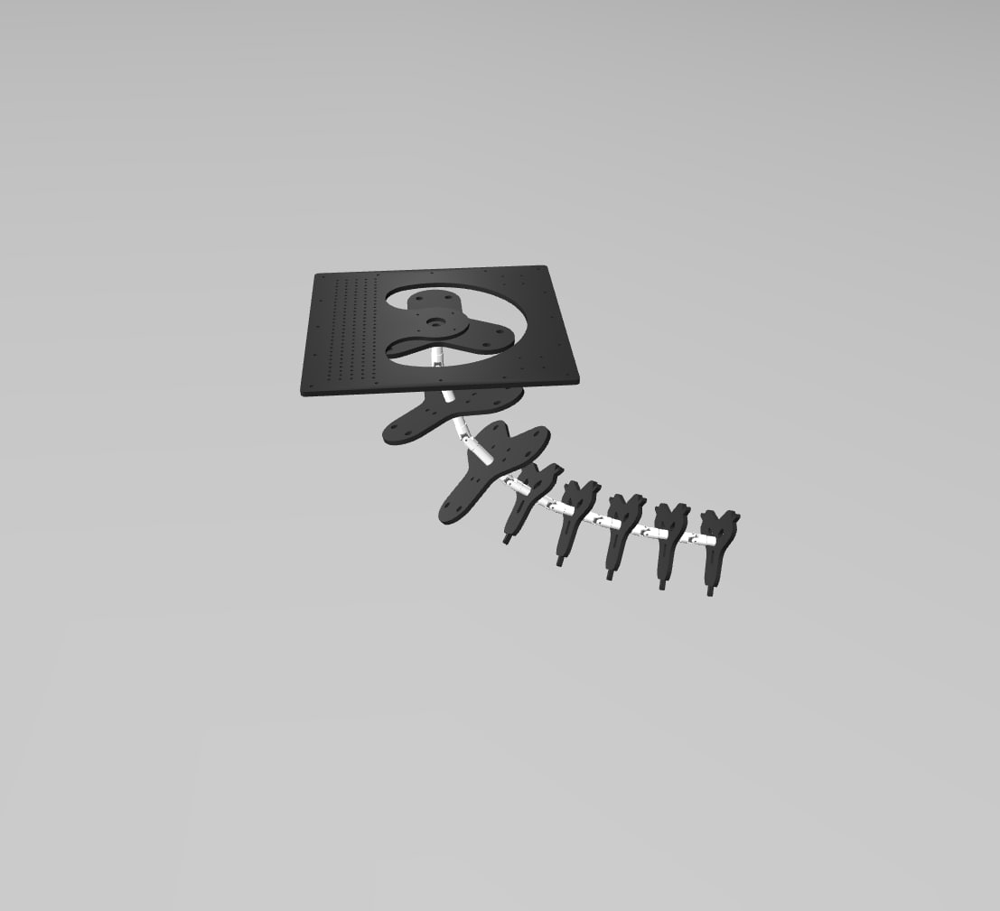
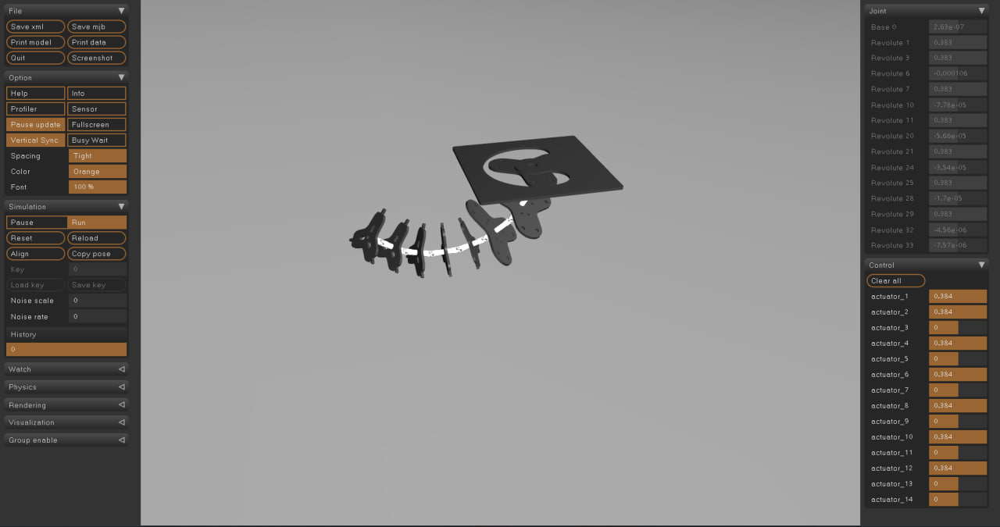

<p align="center">
  
</p>

<p align="center">
  
</p>

# 🧠 Model Soft Robot in MuJoCo

This project simulates a soft modular robot using the MuJoCo physics engine and neural networks trained on real pressure-angle data. Each module independently predicts its bending angles based on 3 pressure values.

---

## 📦 Project Structure

```
Soft_Robot_mujoco/
├── angles/               # Pre-trained neural network models (.h5) and scalers (.pkl)
├── data/                 # Excel files with training data for each module
├── image/                # Project-related images (used in this README)
├── to_mujoco/            # Contains myrob1.xml and required STL meshes for MuJoCo
├── neuron_set.py         # Script to train networks using data{i}.xlsx
├── sender_angels.py      # Main simulation script: loads models, predicts, launches MuJoCo
├── test_neuron_data.py   # Standalone test of one module with example input
├── requirements.txt      # Required Python packages
└── Readme.md             # This documentation file
```

---

## 🔧 Installation Guide

### 1. 📥 Python Environment

Install Python ≥ 3.8, then install required libraries:

```bash
pip install -r requirements.txt
```

Contents of `requirements.txt`:

```
numpy
pandas
scikit-learn
keras
joblib
mujoco
openpyxl
```

---

### 2. ⚙️ Installing MuJoCo

MuJoCo (Multi-Joint dynamics with Contact) is a real-time physics engine.

#### 📌 Steps:

1. Go to https://mujoco.org and create a free account.
2. Download **MuJoCo 2.1+** and extract to:

```
C:/Users/YourName/.mujoco/mujoco210/
```

3. Add MuJoCo to your system PATH:

```
C:/Users/YourName/.mujoco/mujoco210/bin
```

4. Verify installation:

```bash
python -c "import mujoco"
```

✅ If no error — it's installed!

---

### 3. 📁 Prepare Robot Model for Simulation

Your MuJoCo robot model is described in `myrob1.xml` and uses multiple `.stl` files.

#### 📌 Setup:

1. Copy the folder `to_mujoco/` into your MuJoCo models folder, e.g.:

```
C:/Users/YourName/.mujoco/mujoco210/models/soft_robot/
```

Resulting structure:

```
C:/Users/YourName/.mujoco/mujoco210/models/soft_robot/
├── myrob1.xml
└── stl/
    ├── base_link.stl
    ├── joint_new1_1.stl
    ├── ...
```

2. In `sender_angels.py`, set the path to the XML model:

```python
xml_path = 'C:/Users/YourName/.mujoco/mujoco210/models/soft_robot/myrob1.xml'
```

---

## 🚀 How to Use the Project

### 1. 🧠 Train Neural Networks

To train models from Excel files:

```bash
python neuron_set.py
```

This script loads `data/data{i}.xlsx` and trains models for each of the 6 robot modules. Models and scalers will be saved in the `angles/` directory.

### 2. 🧪 Test a Single Module

To test module 1 with a pressure input:

```bash
python test_neuron_data.py
```

You’ll see the predicted bending angles printed in degrees.

### 3. 🤖 Run Full MuJoCo Simulation

Launch simulation with real-time visualization:

```bash
python sender_angels.py
```

- Loads models from `angles/`
- Feeds in test pressure values
- Predicts 12 joint angles
- Applies them to the MuJoCo simulation

A viewer window will open with a 3D model of your soft robot moving based on predictions.

---

## 🛠 Customization

| Feature               | File                | Where to Change                  |
|-----------------------|---------------------|----------------------------------|
| Pressure inputs       | `sender_angels.py`  | `test_inputs = {...}`           |
| NN architecture       | `neuron_set.py`     | Keras `Sequential()` block       |
| Datasets              | `data/`             | Replace or add `data{i}.xlsx`   |
| Model file path       | `sender_angels.py`  | `xml_path = ...`                |
| STL mesh filenames    | `myrob1.xml`        | `<mesh file="..." ... />`       |

---

## 📜 License

MIT License — free to use, modify and cite with attribution.

---

## 🎓 Author

Developed by Maksym Atamaniuk
