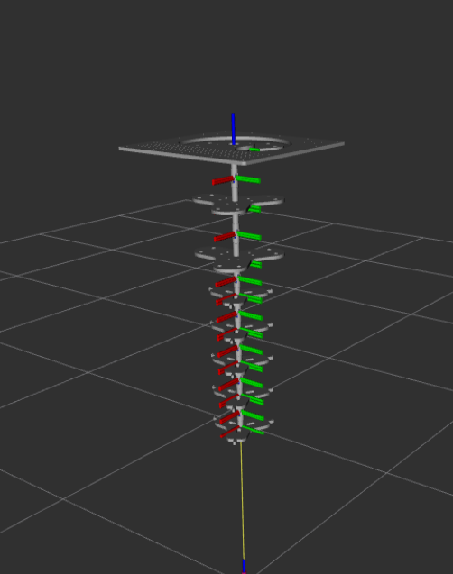
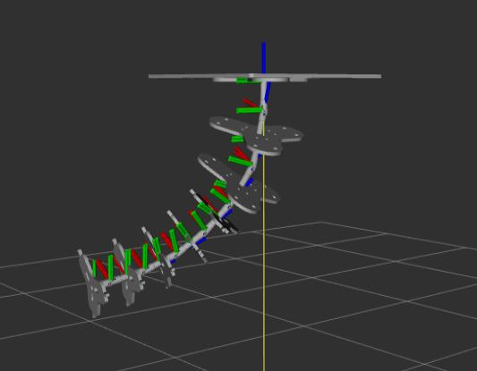
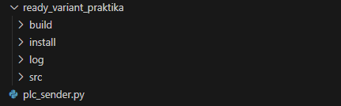
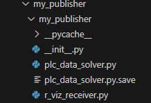

<h1 align="center">PneuTrunk_ROS2</h1>


<p align="center">
  
  &nbsp;&nbsp;&nbsp;
  
</p>

#### This document will describe the detailed installation of the SOFTWARE to control the PneuTrunk soft robot using ROS2. For installation we need pre-installed  Ubuntu 22.04 because this project uses ROS2(HUMBLE).


<h2 align="center">🚀 Installation and Environment Setup</h2>

To run this project correctly, make sure the following components are installed:

---

### 🧩 Install ROS 2 Humble

Follow the official installation guide for your OS:  
👉 [ROS 2 Humble Installation Guide](https://docs.ros.org/en/humble/Installation.html)

---

### Install Python 3 (recommended: Python 3.10+)

Check if Python is installed:

```bash
python3 --version
```
If not installed:
```
sudo apt install python3 python3-pip
```
### Install ROS 2 Python dependencies

```
sudo apt install python3-colcon-common-extensions python3-rosdep python3-argcomplete
```
### Initialize rosdep
```
sudo rosdep init
rosdep update
```

### 📦 Required ROS 2 Packages (Humble)
Make sure the following ROS 2 Humble packages are installed:

``` 
sudo apt install ros-humble-robot-state-publisher \
                 ros-humble-joint-state-publisher \
                 ros-humble-joint-state-publisher-gui \
                 ros-humble-rviz2 \
                 ros-humble-xacro
 ```


Done! Your system is now ready to use ROS 2, run Python scripts.


<h2 align="center">Structure of the project</h2>



Once you open this repository, you will see these folders. We are only interested in the **src** folder, which contains the main elements of the system. Here you will also find the file **plc_sender.py**, which serves as a GUI for sending pressure values directly to the PLC.

In order to see all the packages of this project you need to follow this path:

```src --> my_publisher --> my_publisher```

The contents of this folder will look like this.



 #### ⚠️ Note: While this directory contains several files, only plc_data_solver.py and r_viz_receiver.py are relevant to the functionality of this project. The rest can be ignored.

## 🔧 plc_data_solver ##
The plc_data_solver node is responsible for establishing communication with the Programmable Logic Controller (PLC). Its primary role is to receive raw sensor or control data from the PLC, process it, and prepare it for integration into the ROS 2 ecosystem.

Key functionalities:

Listens for incoming data from the PLC (in our case UDP).

Parses and processes the received data into a usable format.

Publishes the processed information to a specific ROS 2 topic, making it accessible to other nodes in the system for further use or analysis.

This node acts as a bridge between the external PLC hardware and the ROS 2 environment, enabling smooth data flow and real-time interaction.

## 🎯 r_viz_receiver ##
The r_viz_receiver node is responsible for subscribing to angle data published by other nodes (e.g., predicted joint angles or sensor feedback) and visualizing them in RViz, ROS's standard 3D visualization tool.

Key functionalities:

Subscribes to a ROS 2 topic that contains angle or pose information.

Converts the received data into appropriate visualization messages (e.g., sensor_msgs/JointState, visualization_msgs/Marker, etc.).

Publishes the data in a way that allows RViz to display the robot’s joint positions or movement in real-time.

This node is essential for providing a visual representation of the robot’s current state, aiding in debugging, monitoring, and demonstration purposes.

---

```src --> test2025_description```

 ### 🤖 Robot Description – test2025_description
In the root of the project, you will find the folder test2025_description, which contains the full robot description package.

This folder includes:

- URDF/XACRO files – used to define the robot's physical and visual structure.

- Launch files – to easily start and visualize the robot in RViz or other ROS 2 tools.

- Any additional resources required for robot visualization and configuration.

📌 This folder serves as the foundation for the robot's model and is used in conjunction with r_viz_receiver.py for real-time visualization in RViz.

<h2 align="center">PROGRAM LAUNCH</h2>

Each module of this program can be run separately (e.g. debugging), but it is also possible to run all modules together.

```ros2 run my_publisher plc_ros_node ```

```ros2 run my_publisher plc_rviz_node ```

#### 🛠 Note: The names of these executable nodes (plc_ros_node, plc_rviz_node) are defined in the setup.py file of this package and can be changed there if needed.

### 🔹 Run the full system with robot visualization
To start the full robot description and RViz visualization, use the launch file:

```ros2 launch test2025_description display.launch.py gui:=False```

This will:

- Load the robot model from the test2025_description package

- Initialize RViz with a pre-configured display setup

- Launch the necessary publishers for joint states and transforms

📌 Tip: After installing, don’t forget to source your workspace:


``` source install/setup.bash```

⚠️ Note: If you're working in a custom workspace, make sure to adjust the path accordingly. For example:

```source ~/your_workspace_name/install/setup.bash```

✅ Replace your_workspace_name with the actual name of your workspace directory.